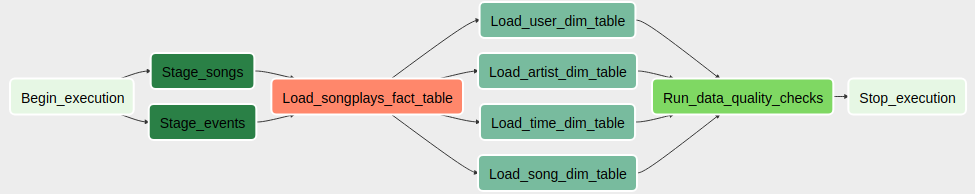

# DEP5 - Data Pipeline with Airflow
Project 5 of the Data Engineering Nanodegree <br>
Michal Pytlos, October 2019

### Overview
DEP5 is a data pipeline built for a music streaming startup. The startup's data is stored on S3 in the form of JSON logs. DEP5 loads this data periodically into a set of dimensional tables on Amazon Redshift.

The data pipeline is defined in Apache Airflow as the directed acyclic graph (DAG) shown in Figure 1. DAG instances as well as individual tasks are managed and monitored using Airflow's UI.



*Figure 1: DEP5 DAG*

DEP5 defines the following operators:
* StageToRedshiftOperator
  * Copies data from JSON files stored on S3 to table on Redshift
  * used by Stage_songs and Stage_events tasks
* LoadDimensionOperator
  * Executes given insert query on Redshift optionally deleting all entries from the target table prior to the insert.
  * used by Load_&ast;_dim table tasks
* LoadFactOperator
  * Executes given insert query on Redshift
  * used by Load_songplays_fact_table task
* DataQualityOperator
  * Executes given select query on Redshift and compares the result with the given expected value; if the values differ, raises an exception.
  * used by Run_data_quality_checks task

### Prerequisites
* Python 3.6.3 or higher with psycopg2 2.8 or higher
* Apache Airflow 1.10.2 or higher with postgres subpackage
* Access to Amazon Redshift cluster (ideally in the same region as the S3 bucket i.e. us-west-2)

### Configuration
#### Create tables script
Set the configuration variables in **ct.cfg** as per below:

| Section | Field  | Value*|
| -------| --------|-------|
| CLUSTER| HOST| endpoint provided in the Redshift management console without the port part|
| CLUSTER| DB_NAME| Redshift database name|
| CLUSTER| DB_USER| Redshift master user|
| CLUSTER| DB_PASSWORD| Redshift master user password|
| CLUSTER| DB_PORT| Redshift database port (default is 5439)|

*&ast;All field values in ct.cfg must be inside single quotes*
#### Airflow
1. Set `dags_folder` **in airflow.cfg** to path to DEP5 **dags** directory
2. Set `iam_role_arn` field in **dp.cfg** to ARN of IAM role allowing Redshift to read from S3
3. Import variables from **dp.cfg** to Airflow:
  1. in Airflow UI open Admin Tab
  2. Select Variables from dropdown menu
  3. Select **dp.cfg** and import variables
4. Create redshift connection in Airflow:
  1. in Airflow UI open Admin Tab
  2. Select Connections from dropdown menu
  3. Open Create tab
  4. Fill in the fields as per below:


  | Field     | Value                                    |
  | --------- | ---------------------------------------- |
  | Conn id   | redshift                                 |
  | Conn Type | Postgres                                 |
  | Host      | endpoint provided in the Redshift management console without the port part |
  | Schema    | Redshift database name                   |
  | Login     | Redshift master user                     |
  | Password  | Redshift master user password            |
  | Port      | Redshift database port (default is 5439) |


### Usage
To create staging and analytics tables on Redshift:
1. Navigate to the directory containing **create_tables.py**
2. Run `python create_tables.py`

To activate, manage and monitor the DAG use Airflow UI

### File structure

File structure of the program is outlined below.

```
DE_p5
├── create_tables
│   ├── create_tables.py
│   ├── ct.cfg
│   └── sql_queries.py
├── dags
│   └── dep5_dag.py
├── dp.cfg
├── plugins
│   ├── helpers
│   │   ├── __init__.py
│   │   └── sql_queries.py
│   ├── __init__.py
│   └── operators
│       ├── data_quality.py
│       ├── __init__.py
│       ├── load_dimension.py
│       ├── load_fact.py
│       └── stage_redshift.py
└── README.md
```
Chosen files and directories are briefly described in the table below.

| File/directory    | Description                                             |
|-------------------| --------------------------------------------------------|
| create_tables/    | Directory containing create tables tool                 |
| create_tables.py  | Create tables script                                    |
| ct.cfg            | Configuration file for create tables script             |
| sql_queries.py    | SQL statements used by create table script              |
| dags/             | Directory with DAGs                                     |
| dep5_dag.py       | DEP5 DAG definition                                     |
| dp.cfg            | File with configuration variables to be imported into Airflow |
| plugins/          | Directory with custom plugins used by DEP5 DAG          |
| helpers/          | Directory with helper files used by plugins             |
| sql_queries.py    | SQL statements used by custom operators                 |
| operators/        | Directory with custom operators used by DEP5 DAG        |
| data_quality.py   | Data quality operator definition                        |
| load_dimension.py | Load dimension operator defintion                       |
| load_fact.py      | Load fact operator definition                           |
| stage_redshift.py | Staging operator defintion                              |
